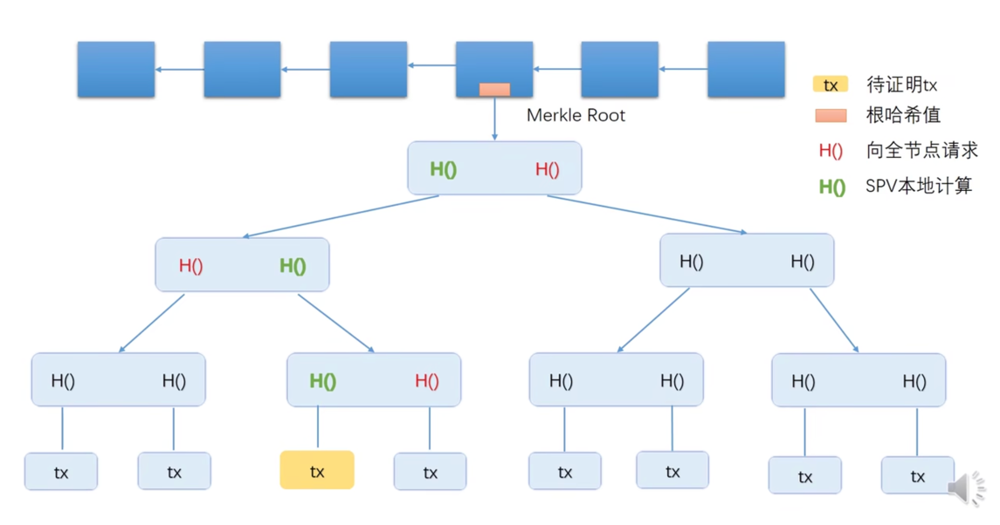

# 密码学原理

密码学中的[哈希函数](https://zh.wikipedia.org/wiki/%E6%95%A3%E5%88%97%E5%87%BD%E6%95%B8) Cryptographic hash function

## 性质
### 性质1：collision resistance/free

x \ne y , H(x)=H(y)
 
理论上无法证明。

### 性质2 ：hiding

空间足够大，暴力遍历不可行。分布均匀。

### `Bitcoin`专有性质3：puzzle friendly

计算是不可预测的，只能一个一个尝试。挖矿的过程是找一个随机数nonce，和其他信息结合一起获得哈希值。
满足`H(block header)<=target`

只有落在前面的区域才是合法的；output space
挖矿很难；验证很容易： difficult to solve, but easy to verify

bitcoin用的Hash函数：SHA-256(secure hash algorithm)

## 功能

### Hash

在本地创造公钥和私钥对。(public key, private key)
来源于非对称的加密体系 (asymmetric encryption algorithm)

私钥保密；公钥可以公开。

### 签名

交易过程：
发起交易时，用私钥对交易签名，其他人用公钥验证签名。
签名用的私钥，验证用公钥。

两人公私钥对相同：实际过程不可行，产生公私对的概率是微乎其微的。
假设产生共私钥的时候，有一个好的随机源good source of randomness。

# 比特币的数据结构

## Hash pointers

除了保存位置，还会保存hash值。为了检查是否结构体被篡改。

BlockChain is a linked list using hash pointers.first block is called genesis block.创世纪块。

取HASH是将整的区块内容包括pointer合在一起取Hash: tamper-evident log.

保存了后几块
- 向前方要
- 算Hash值进行演算
- 判断正确与否

## Merkle tree

最下方data blocks，上方是hash pointers。

只要记得根节点的hash值就能确保整个数不被篡改。data blocks记录的是每一个交易。

每一个块包含了block header和block body，header只记录值不记录交易，body记录交易。

手机btc钱包：轻节点。只保存header。

### proof of membership/inclusion

time complexity: O(log(n))

proof of non-membership:O(n). 但是对叶节点的排列顺序有要求，按照从小到大排列，时间复杂度减少。

sorted merkle tree(btc 中不存在，不需要验证不存在的交易)

# 共识协议和系统实现

数字货币和纸质货币的区别：可以复制。
double spending attach

编号：央行维护数据库。记录每个编号的数字货币在谁手中。每次交易都要确认加上看看编号是不是在自己手中。
问题：繁杂。

去中心化。

## 区块链
两部分：block header和block body。
- block body中交易列表
- 取哈希值：块头取哈希

## 系统中的节点

- 全节点 full node/fully validating node
- 轻节点 light node: 只保存header信息

轻节点无法验证交易的合法性。系统中大多数节点是轻节点。

每个人在本地维护一个区块存在的问题：一致性。
分布式的共识distributed consensus 
distributed hash table：需要约定有共同的key value pair

分布式系统 impossibility result：eg. FLP

## Bitcoin中的共识协议

部分节点存在恶意
投票 
sybil attack：女巫攻击

最长合法链

## block reward 出块奖励

coinbase transaction：决定发行货币的唯一方法
刚开始出块奖励：50BTC；21万个币之后奖励就要减半

# Bitcoin 系统的具体实现

UTXO数据结构：还没花掉的交易的集合。 

- transaction-based ledger(BTC)
- account-based ledger (ETH)

用于快速检测双花攻击。

交易费：transaction fee

？ 10分钟挖一个 是大家一起竞争吗 /10分钟之后才发布 谁发布
？ 恶意节点 集合起来 串成一长链

